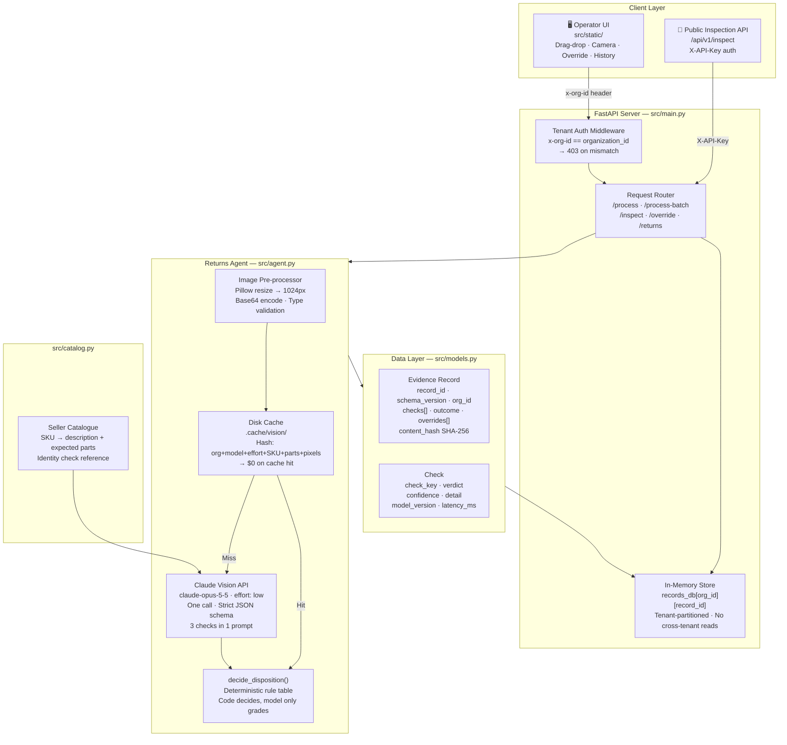
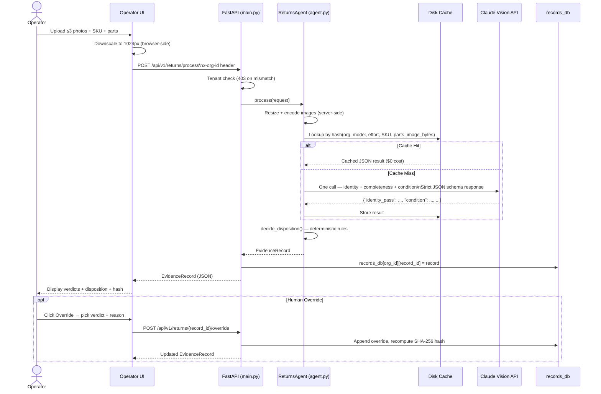

# Architecture: Returns Manager

## System Architecture

---

## Components

| Component | File | Responsibility |
|---|---|---|
| **FastAPI App** | `src/main.py` | HTTP routing, tenant enforcement, record store, override endpoint |
| **Returns Agent** | `src/agent.py` | Image pre-processing, disk cache, Claude call, fail-open, disposition policy |
| **Evidence Models** | `src/models.py` | Pydantic contract, `compute_content_hash` |
| **Seller Catalogue** | `src/catalog.py` | SKU → catalogue description + expected parts (identity reference) |
| **Accounts** | `src/accounts.py` | Client accounts, API key management, unit-order lookup |
| **Public API** | `src/public_api.py` | Multipart photo upload endpoint, per-key rate limiting, daily cap |
| **Eval Harness** | `eval.py` + `eval/labels.csv` | Two-labeller accuracy measurement, cost/latency reporting |
| **Labelling Tool** | `src/eval_api.py` + `src/static/label.html` | Independent two-person labelling UI for the eval set |
| **Operator UI** | `src/static/` | Browser-based inspection, history, override, tenant switcher |

---

## Data Flow

---

## Model / Agent Usage

| Property | Value |
|---|---|
| **Model** | `claude-opus-5-5` (configurable via `RTN_MODEL`) |
| **Effort** | `low` — sufficient for a structured grading task, keeps latency and cost down |
| **Calls per unit** | **1** — identity, completeness, and condition in a single prompt |
| **Output format** | Strict JSON schema enforced via `output_config.format` — no parsing failures |
| **Images per call** | Up to 3, each resized to max 1024px long edge on both client and server |
| **Tokens per unit** | ~1.0–1.4k input per image + ~300 output tokens |
| **Measured cost** | **$0.0181 per unit** (50-unit eval, `claude-opus-5-5`, effort `low`) |
| **p50 / p95 latency** | **6.3 s / 8.1 s** |
| **Cache hit rate** | 47 of 50 eval runs served from disk cache ($0 for re-runs) |
| **Fail-open** | Any API error, timeout, or refusal → all checks `UNCERTAIN`, outcome `pending_review`, record preserved |
| **Fallback** | `fallbacks: "default"` retries a refused request on another model rather than losing the case |

---

## Important Engineering Decisions

### 1. One batched call for three checks
Identity, completeness and condition all use the same photos. One call covers all three. Three separate calls would triple the image token cost. The trade-off is that one bad API response affects all checks simultaneously — mitigated by the strict JSON schema (removes parsing failures) and fail-open (any exception → `UNCERTAIN`, never silent data loss).

### 2. Per-check UNCERTAIN — not a binary "needs more images" flag
Each check returns `PASS | FAIL | UNCERTAIN` independently. A closed shipping carton makes identity `UNCERTAIN`, while a clearly visible bottle with exposed threads is completeness `FAIL` without requiring more photos. This avoids over-requesting images for cases where the answer is actually visible.

### 3. Identity checked against the seller catalogue
The model receives the SKU's catalogue description (`src/catalog.py`), not just the SKU code. An unbranded 750 ml bottle can pass identity because the catalogue says "750 ml stainless-steel water bottle". A label reading "1L" fails. An SKU absent from the catalogue is never allowed to `PASS` — code downgrades it to `UNCERTAIN`.

### 4. Code decides the disposition
`decide_disposition()` is a small deterministic function, not a model output. Policy changes (e.g. routing `Used - Acceptable` to `liquidate` instead of `refurbish`) require one code change, one test update, and a re-deploy — no prompt iteration. The function is fully covered by the offline test suite.

### 5. Tenant isolation at every layer
- HTTP: `x-org-id` must match `organization_id` in the request body (403 otherwise)
- Storage: `records_db[org_id]` — a caller can only see their own partition
- API keys: each key maps to exactly one `org_id`; the caller cannot choose a different tenant
- Cache: cache key includes `organization_id` — results never bleed across tenants
- Image paths: images are not persisted or served; the record stores a `sha256` reference only

### 6. Overrides are data, not replacements
`POST /{record_id}/override` appends `{original_verdict, revised_verdict, reason, operator, timestamp}` to the record's `overrides[]` array. The agent's original checks are never modified. Status becomes `overridden` and `content_hash` is recomputed over the new canonical JSON. Every human disagreement is preserved as a labelled training example for future prompt improvements.

### 7. Content hash is detection, not proof
`content_hash` is SHA-256 over the canonical JSON of the record. It lets a downstream consumer (e.g. Recovery Manager) detect that a record changed between reads. It is **not** signed or anchored to an external ledger, so we do not claim records are tamper-proof — only that changes are detectable.

---

## Known Limitations

- **In-memory store**: records vanish on server restart. Production would use Postgres with row-level security per org. The Render free tier is ephemeral, so records reset on redeploy.
- **No real authentication**: `x-org-id` is a demo stand-in for login. Production would derive tenant from a signed auth token or session.
- **Images via base64 JSON**: the operator UI sends images as base64-encoded JSON. Production would use multipart upload or presigned object-store URLs with per-tenant buckets.
- **Condition definitions**: paraphrased from Amazon's Condition Guidelines for the synthetic eval set. They should be re-verified against the live Amazon Seller Central page per category before production use.
- **Disposition policy is our own**: derived from the problem statement and sample data patterns. It is documented and tested but not an Amazon-published rule.

---

## Dependencies

| Package | Purpose |
|---|---|
| `FastAPI` | HTTP framework, routing, request validation |
| `Pydantic` | Evidence contract schema, input validation |
| `anthropic` | Claude Vision API client |
| `Pillow` | Image resize and base64 encoding |
| `python-dotenv` | Environment variable loading |

Python 3.10+ required.

## Security

No secrets in the repository. `.env` is git-ignored. `.env.example` holds only placeholder values. All model output shown in the UI is HTML-escaped before rendering.
